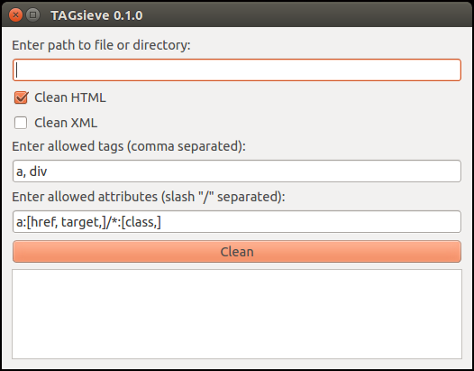

========
TAGsieve
========

TAGsieve is a small HTML/XML stripper GUI application, written in Python and based on the HTML sanitizer bleach_. It strips or batch strips tags from .html, .htm, or .xml files, ignoring specified tags and attributes via whitelists.

Basic use
=========
TAGsieve is a simple GUI application that strips tags of a single file or a directory of files.

It follows bleach_ and works with tag and attribute whitelists: these tags and attributes will not be stripped. The tag whitelist must be a comma-separated list:

.. code-block:: python

	x₁,..., xₙ

The attribute whitelist must be entered according to the following pattern::

	x₁:[a₁,..., aₙ,]/.../xₙ:[a₁,..., aₙ,] for each tag x₁-xₙ and attributes a₁-aₙ.

Installation
============
Install Python on your machine, using the Anaconda_ distribution. This includes the PyQt package needed for the GUI.

After installing the distribution, check if PyQt is there::

	$ conda install pyqt

Then run::

	$ pip install TAGsieve

This should install the requirements used for TAGsieve. Start the program in terminal by running::

	$ python TAGsieve

.. _bleach: https://github.com/jsocol/bleach
.. _Anaconda: http://continuum.io/downloads
