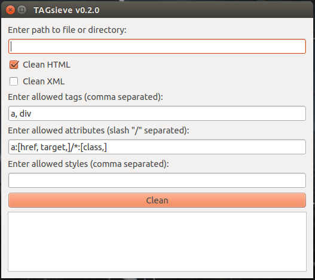

========
TAGsieve
========

TAGsieve is a small HTML/XML stripper GUI application, written in Python and based on the HTML sanitizer bleach_. It strips or batch strips tags from .html, .htm, or .xml files, ignoring specified tags and attributes via whitelists.

Basic use
=========
TAGsieve is a simple GUI application that strips tags of a single file or a directory of files.

It follows bleach_ and works with tag and attribute whitelists: these tags and attributes will not be stripped. The tag whitelist must be a comma-separated list:

.. code-block:: python

	x₁,..., xₙ

The attribute whitelist must be entered according to the following pattern::

	x₁:[a₁,..., aₙ,]/.../xₙ:[a₁,..., aₙ,] for each tag x₁-xₙ and attributes a₁-aₙ.

Installation
============
If you're on Linux, use the dist folder. In the other cases, install via source code.

Via source code
---------------
Install Python on your machine. If you're on Windows or Mac, install the Anaconda_ distribution of Python, as it includes the PyQt package needed for the GUI.

With Python installed, download the zip folder and run::

	$ python setup.py install (delete, for developers)

	use pip (register at PyPi: python setup.py register/publish)
	Anaconda + run "$ conda install pyqt"

This should install the requirements used for TAGsieve. Start the program by running::

	$ python TAGsieve/TAGsieve.pyw

or::

	$ ./TAGsieve/TAGsieve.pyw

Via dist folder
-----------------
Installation is not required. Save the 'dist' folder to your computer, open the folder location, and double click the TAGsieve executable.

The dist folder is only suitable for Linux.

.. _bleach: https://github.com/jsocol/bleach
.. _Anaconda: http://continuum.io/downloads
